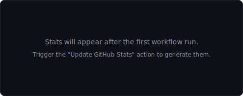
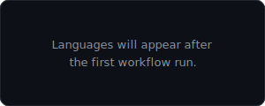

    

<h1 align="center">
    Hi
    
    , I'm Suleiman
</h1>
<h3 align="center">
    Backend Software Engineer with 4+ years of experience, passionate about building scalable and distributed systems. Specialized in Python, Django, and fintech integrations.
</h3>

## 🙋‍♂️ About Me

- 🔭 I'm currently working at **[Holouly](https://holouly.io/)**

- 🌱 I'm currently focusing on **Advanced Databases, System Design, Distributed Systems, Microservices, and FastAPI**

- 👯 I'm looking to collaborate on **OpenSource Projects**

- 👨‍💻 I am currently reading **Designing Data-Intensive Applications** 

- 📫 How to reach me **suleimanhesham99@gmail.com**

- ⚡ Fun fact **I often play football and go to the gym.**

## 🚀 Languages and Tools:

 
    
    
    
    
    
    
    
    
    
    
    
     
    
       
    
     
     
     
     

 

    

## 📊 My Github Stats

 

 
<b>Note:</b> Top languages is only a metric of the languages my public code consists of and doesn't reflect experience or skill level.

 
 

## Connect with me:

    
    
    
    
    

## ❤ Views and Followers

